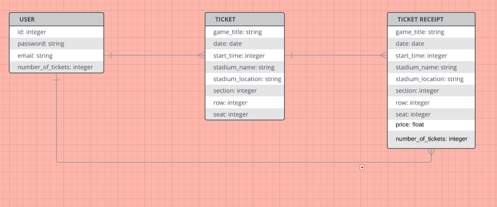

# Tickets On Ice App
Will be for both mobile and desktop.

# MVP
To allow users to search for and buy tickets to hockey games.

# User Stories

<ul>
  <li>User opens Tickets On Ice app and signs up</li>
  <li>User buys ticket to a hockey game</li>
  <li>User chooses number of tickets they want to buy and adjusts ticket cost</li>
  <li>User selects location of seat</li>
  <li>User sees order info on the following page and proceeds to purchase ticket</li>
  <li>User has option to do mobile ticketing</li>
  <li>User finalizes ticket purchase</li>
  <li>Ticket is now available under user's account to be scanned at the hockey game</li>
</ul>

# Wireframes
Phone version: https://drive.google.com/open?id=1DPd0c6QZN-IgwdTQU6XbYkrnJmse46If
 Desktop version: https://drive.google.com/open?id=10gSUG0ackIVXgm_SrtUFiTKIJdWE1j-W

# ERD

# Sprints
<ul><b>Sprint 1 (4/9):</b></ul>
<li>Get Landing page done</li>
 

<ul><b>Sprint 2 (4/10):</b></ul>
<li>Implement Discovery API and Commerce API from Ticketmaster into event search, ticketing, and pricing.</li>
<li>Use Partner API from Ticketmaster for purchasing tickets</li>
 

<b><ul>Sprint 3 (4/11):</ul></b>
<li>Create a hamburger menu</li>
<li>Create Sign In/Sign Up pages with Ticketmaster OAuth.</li>
<li>Create splash page</li>
 

<b><ul>Sprint 4 (4/12):</ul></b>
<li>Create page to view tickets</li>
<li>Make a page that lists hockey arenas in alphabetical order for users to choose from.</li>
<li>Make the account page.</li>
<li>Create a desktop version for the app</li>

# Tools to use
Git, GitHub, NodeJS, and MongoDB

# Outside Tools
SeatGeek APIs
